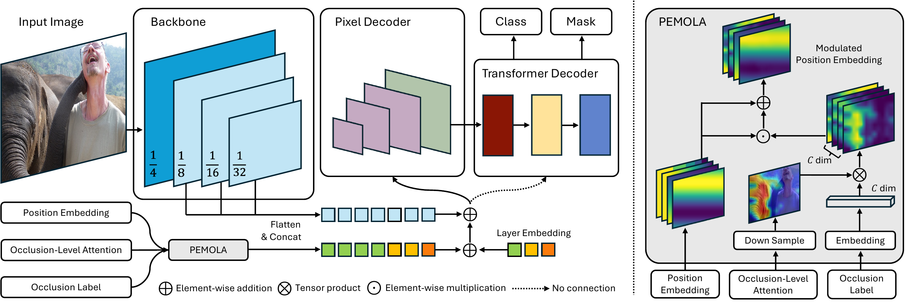

# Occlusion-Aware Panoptic Segmentation with Joint Position Embedding and Occlusion-Level Attention (ICME 2026)

<p align="center">
  <a href="https://scholar.google.com/citations?user=45fCx08AAAAJ&hl=en">Wenbo Wei</a>,
  <a href="https://scholar.google.com/citations?user=b_jEBHEAAAAJ&hl=en">Jun Wang</a>,
  <a href="https://scholar.google.com/citations?user=yPKOcgQAAAAJ&hl=en">Shan Raza</a>,
  <a href="https://scholar.google.com/citations?user=XfBoSP4AAAAJ&hl=en">Abhir Bhalerao</a>
  <br>
  University of Warwick
</p>

<p align="center">
  <a href="#citation"></a>
  <a href="LICENSE"></a>
  <a href="https://www.python.org/"></a>
  <a href="https://pytorch.org/"></a>
  <a href="#acknowledgements"></a>
</p>

<p align="center"></p>

---

## Table of Contents
- [News](#news)
- [Abstract](#abstract)
- [Highlights](#highlights)
- [Model Zoo &amp; Results](#model-zoo--results)
- [Installation](#installation)
- [Data Preparation](#data-preparation)
- [Training](#training)
- [Evaluation](#evaluation)
- [Inference &amp; Visualization](#inference--visualization)
- [Citation](#citation)
- [Acknowledgements](#acknowledgements)
- [License](#license)

---

## News
- [2026-03] Paper accepted to **ICME 2026**.

## Abstract

Transformer-based panoptic segmenters degrade sharply on heavily occluded scenes. We propose **PEMOLA**, a lightweight plug-and-play module that turns occlusion into an explicit signal: a Swin-based classifier predicts per-pixel occlusion level, Grad-CAM lifts it into a spatial attention map, and both the map and a learned occlusion label embedding modulate the joint position embedding of the mask decoder. On **COCO-OLAC** and **Cityscapes-OLAC**, PEMOLA delivers consistent gains in $\text{PQ}$, $\text{PQ}^{\text{Th}}$, $\text{AP}_{\text{pan}}^{\text{Th}}$ and $\text{mIoU}_{\text{pan}}$ when added to both Mask2Former and Mask DINO.

## Highlights

- **Plug-and-play.** Drops into any transformer-based panoptic segmenter (Mask2Former, Mask DINO) without architectural changes to the backbone or mask decoder.
- **Occlusion-aware queries.** Combines spatial (Grad-CAM) and channel-wise (label embedding) occlusion cues directly at the joint position embedding.
- **Lightweight.** A single classifier forward pass + one modulation step per query at inference; <1% added FLOPs.
- **Backbone-agnostic.** Validated end-to-end on ResNet-50; drop-in configs for ResNet-101, Swin-T/S/B/L, **DINOv3** and **SAM 3** ViT backbones are included for easy extension.
- **Generalises across datasets.** Improves PQ on both **COCO-OLAC** and the newly annotated **Cityscapes-OLAC**, with the largest gains on the heavily-occluded subset.

---

## Model Zoo &amp; Results

`†` denotes our re-trained baseline under identical training schedule for a fair comparison.
All numbers are panoptic-segmentation metrics on the *full* OLAC validation set (heavily-occluded subset numbers are reported in the paper).

### Panoptic Segmentation on COCO-OLAC

| Backbone | Method | Epoch | $\text{PQ}$ | $\text{PQ}^{\text{Th}}$ | $\text{PQ}^{\text{St}}$ | $\text{AP}_{\text{pan}}^{\text{Th}}$ | $\text{mIoU}_{\text{pan}}$ | Config |
|:---|:---|:---:|:---:|:---:|:---:|:---:|:---:|:---:|
| ResNet-50 | Mask2Former † | 50 | 40.7 | 44.5 | 35.0 | 30.0 | 54.2 | [yaml](configs/coco_olac/panoptic-segmentation/mask2former_COCO-OLAC_R50_bs16_50ep.yaml) |
| ResNet-50 | **+ PEMOLA** | 50 | **41.5** | **45.2** | **35.9** | **30.4** | **54.8** | [yaml](configs/coco_olac/panoptic-segmentation/pemola_R50_bs16_50ep.yaml) |
| ResNet-50 | Mask DINO † | 50 | 44.0 | 48.5 | 37.3 | 33.5 | 53.4 | — |
| ResNet-50 | **+ PEMOLA** | 50 | **44.8** | **49.4** | **37.8** | **34.2** | **55.3** | — |

### Panoptic Segmentation on Cityscapes-OLAC

| Backbone | Method | Iter | $\text{PQ}$ | $\text{PQ}^{\text{Th}}$ | $\text{PQ}^{\text{St}}$ | $\text{AP}_{\text{pan}}^{\text{Th}}$ | $\text{mIoU}_{\text{pan}}$ | Config |
|:---|:---|:---:|:---:|:---:|:---:|:---:|:---:|:---:|
| ResNet-50 | Mask2Former † | 90k | 61.5 | 54.0 | 66.9 | 35.2 | 76.1 | [yaml](configs/cityscapes/panoptic-segmentation/maskformer2_R50_bs16_90k.yaml) |
| ResNet-50 | **+ PEMOLA** | 90k | **62.3** | **55.4** | **67.2** | **38.5** | **77.4** | [yaml](configs/cityscapes/panoptic-segmentation/maskformer2_R50_bs16_90k.yaml) |

### Occlusion Classifier (auxiliary)

Evaluated on the COCO-OLAC three-way (low / mid / high) occlusion-level classification task; numbers are best-epoch Top-1 accuracy (%) on the validation split with background-blackened inputs.

<table>
<thead>
<tr>
  <th align="left">Backbone</th>
  <th align="center">Pretraining</th>
  <th align="center">Input</th>
  <th align="center">Top-1 Acc (%)</th>
  <th align="center">Config</th>
</tr>
</thead>
<tbody>
<tr><td align="left">ResNet-50</td>       <td align="center">ImageNet-1K</td>       <td align="center">224</td> <td align="center">70.51</td>     <td align="center"><a href="configs/occlusion_cls/resnet/resnet50.yaml">yaml</a></td></tr>
<tr><td align="left">ResNet-101</td>      <td align="center">ImageNet-1K</td>       <td align="center">224</td> <td align="center">70.95</td>     <td align="center"><a href="configs/occlusion_cls/resnet/resnet101.yaml">yaml</a></td></tr>
<tr><td align="left">Swin-T</td>          <td align="center">ImageNet-22K</td>      <td align="center">224</td> <td align="center">71.63</td>     <td align="center"><a href="configs/occlusion_cls/swin/swin_tiny_patch4_window7_224_22k.yaml">yaml</a></td></tr>
<tr><td align="left">Swin-S</td>          <td align="center">ImageNet-22K</td>      <td align="center">224</td> <td align="center">72.13</td>     <td align="center"><a href="configs/occlusion_cls/swin/swin_small_patch4_window7_224_22k.yaml">yaml</a></td></tr>
<tr><td align="left">Swin-B</td>          <td align="center">ImageNet-22K</td>      <td align="center">224</td> <td align="center">72.75</td>     <td align="center"><a href="configs/occlusion_cls/swin/swin_base_patch4_window7_224_22k.yaml">yaml</a></td></tr>
<tr><td align="left">Swin-B</td>          <td align="center">ImageNet-22K → 1K</td> <td align="center">384</td> <td align="center">75.32</td>     <td align="center"><a href="configs/occlusion_cls/swin/swin_base_patch4_window12_384_22kto1k_finetune.yaml">yaml</a></td></tr>
<tr><td align="left">Swin-L</td>          <td align="center">ImageNet-22K</td>      <td align="center">224</td> <td align="center">73.29</td>     <td align="center"><a href="configs/occlusion_cls/swin/swin_large_patch4_window7_224_22k.yaml">yaml</a></td></tr>
<tr><td align="left"><b>Swin-L</b></td>    <td align="center">ImageNet-22K → 1K</td> <td align="center">384</td> <td align="center"><b>75.56</b></td> <td align="center"><a href="configs/occlusion_cls/swin/swin_large_patch4_window12_384_22kto1k_finetune.yaml">yaml</a></td></tr>
</tbody>
</table>

---

## Installation

All experiments reported in this paper are conducted on **3× NVIDIA A100 (40 GB)** with **CUDA 13.0**.
A single command sets up the `pemola` conda environment:

```bash
bash install_env.sh
```

The script installs, in order:

1. A clean conda env (`pemola`, Python **3.12**).
2. The matched compiler toolchain (`gcc`/`g++` 14) — required because system GCC 15 is too new for `nvcc`.
3. The full **CUDA toolkit 13.0** (we need `cusparse.h`, which is missing from the slim `cuda-cudart-dev`).
4. An activation hook that exports `CUDA_HOME` and `TORCH_CUDA_ARCH_LIST=8.9`.
5. **PyTorch 2.11 + cu130**.
6. **detectron2 0.6**, built from source.
7. Python dependencies from `requirements.txt`.
8. The **MSDeformAttn** CUDA op (patched in-tree for the modern PyTorch API).

> **Optional backbones.** For experiments with foundation models we provide standalone installers that share the same env:
>
> ```bash
> bash install_dinov3.sh   # DINOv3 ViT backbone
> bash install_sam3.sh     # SAM3   ViT backbone
> ```

Each installer block in `install_env.sh` is idempotent — you can re-run individual sections without rebuilding the whole env.

---

## Data Preparation

PEMOLA is evaluated on **COCO-OLAC** ([Wei *et al.*, 2025](https://github.com/wenbo-wei/COCO-OLAC)) and **Cityscapes-OLAC** (introduced in this work).
Place the datasets under `datasets/data/`:

```
datasets/data/
├── coco_olac/
│   ├── train/, val/                      # RGB images
│   ├── annotations/                      # panoptic + instance JSONs
│   └── occlusion_label_{train,val}.json  # per-instance occlusion level
├── cityscapes_olac/
│   └── ...
└── coco_olac_cls/                        # bg-blackened crops for the classifier
    ├── train/<class>/*.jpg
    └── val/<class>/*.jpg
```

For the **occlusion classifier**, training images are pre-processed by blackening non-object regions
(this restricts the classifier's receptive field to the instance and removes scene-context bias):

```bash
python tools/blacken_bg.py \
    --dataset    coco \
    --data_path  datasets/data/coco/train2017 \
    --ann_path   datasets/data/coco/annotations/instances_train2017.json \
    --output_path datasets/data/coco_olac_cls/train
```

Set `DETECTRON2_DATASETS=datasets/data` (already exported by every script under `scripts/`) so that detectron2 resolves dataset paths correctly.

---

## Training

All training entry points live under `scripts/`. Each script wraps `train_net.py` (segmentation) or `occ_cls_train.py` (classifier) and reads the corresponding YAML in `configs/`.

### 1. Occlusion classifier

```bash
bash scripts/occ_cls_train_swin.sh    # Swin-L,  used in main results
bash scripts/occ_cls_train_res.sh     # ResNet baselines (50 / 101)
```

### 2. PEMOLA panoptic segmentation on COCO-OLAC

```bash
bash scripts/train_pemola_olac_r50.sh      # ResNet-50
bash scripts/train_pemola_olac_swin.sh     # Swin-L  (IN-22K, 384)
bash scripts/train_pemola_olac_dinov3.sh   # DINOv3  ViT
bash scripts/train_pemola_olac_sam3.sh     # SAM3    ViT
```

> Scripts in `scripts/` ship with `--num-gpus 2` for typical local development. The paper numbers are reproduced with `--num-gpus 3` on **3× A100 (40 GB)**; adjust the flag (and `SOLVER.IMS_PER_BATCH` in the YAML) to match your hardware.

### 3. PEMOLA panoptic segmentation on Cityscapes-OLAC

Use the configs under `configs/cityscapes/panoptic-segmentation/` with the same `train_net.py` interface; example:

```bash
export DETECTRON2_DATASETS=datasets/data
python train_net.py \
    --config-file configs/cityscapes/panoptic-segmentation/maskformer2_R50_bs16_90k.yaml \
    --num-gpus 3
```

---

## Evaluation

```bash
bash scripts/eval_pemola_olac_r50.sh       # ResNet-50
bash scripts/eval_pemola_olac_swin.sh      # Swin-L
bash scripts/eval_pemola_olac_dinov3.sh    # DINOv3 ViT (smoke-test by default; see script header)
bash scripts/eval_pemola_olac_sam3.sh      # SAM3   ViT (smoke-test by default; see script header)
bash scripts/eval_base_city_r50.sh         # Cityscapes-OLAC baseline
```

Each eval script expects the trained checkpoint at `output/<run>/model_final.pth`.
Override on the command line, e.g.:

```bash
bash scripts/eval_pemola_olac_r50.sh MODEL.WEIGHTS /path/to/model_final.pth
```

---

## Inference &amp; Visualization

**Per-image panoptic prediction** (writes a colourised PNG and the raw segments JSON):

```bash
python predict.py \
    --config-file configs/coco_olac/panoptic-segmentation/pemola_R50_bs16_50ep.yaml \
    --input  <image_or_glob> \
    --output <out_dir> \
    --opts MODEL.WEIGHTS output/pemola/model_final.pth
```

**Occlusion classifier inference** (per-instance occlusion level):

```bash
bash scripts/occ_cls_predict.sh
```

**Grad-CAM visualisation of the occlusion attention map** — the spatial signal that PEMOLA injects into the position embedding:

```bash
bash scripts/occ_cls_draw_cam.sh
```

---

## Citation

If you find PEMOLA useful for your research, please consider citing:

```bibtex
@inproceedings{wei2026pemola,
  title     = {Occlusion-Aware Panoptic Segmentation with Joint Position Embedding and Occlusion-Level Attention},
  author    = {Wei, Wenbo and Wang, Jun and Raza, Shan and Bhalerao, Abhir},
  booktitle = {IEEE International Conference on Multimedia and Expo (ICME)},
  year      = {2026}
}
```

For the **COCO-OLAC** benchmark used in our experiments, please also cite:

```bibtex
@article{wei2025cocoolac,
  title   = {COCO-OLAC: An Occlusion-Level Annotated COCO Benchmark for Panoptic Segmentation},
  author  = {Wei, Wenbo and others},
  journal = {arXiv preprint},
  year    = {2025}
}
```

---

## Acknowledgements

PEMOLA is built on top of the following excellent open-source projects.
Modified portions retain the original copyright headers, in accordance with each project's licence.

- [**Mask2Former**](https://github.com/facebookresearch/Mask2Former) (Meta, MIT) — base panoptic framework.
- [**Mask DINO**](https://github.com/IDEA-Research/MaskDINO) (IDEA, Apache 2.0) — alternative panoptic baseline used in our Mask DINO experiments.
- [**Swin Transformer**](https://github.com/microsoft/Swin-Transformer) (Microsoft, MIT) — Swin-L backbone and occlusion classifier.
- [**Deformable DETR**](https://github.com/fundamentalvision/Deformable-DETR) (SenseTime, Apache 2.0) — MSDeformAttn CUDA op.
- [**DINOv3**](https://github.com/facebookresearch/dinov3) (Meta) — self-supervised ViT backbone.
- [**SAM 3**](https://github.com/facebookresearch/sam3) (Meta) — foundation ViT backbone.
- [**pytorch-grad-cam**](https://github.com/jacobgil/pytorch-grad-cam) (Jacob Gildenblat, MIT) — used as an external dependency for extracting occlusion-level attention via Grad-CAM in `occ_cls_draw_cam.py`. No source code is copied; the library is imported through `pip install grad-cam`.

We thank the authors of these works for releasing their code.

---

## License

This project is released under the **MIT License** — see [LICENSE](LICENSE) for the full text.
Code adapted from third-party projects retains its original licence and copyright notice.

[](LICENSE)
