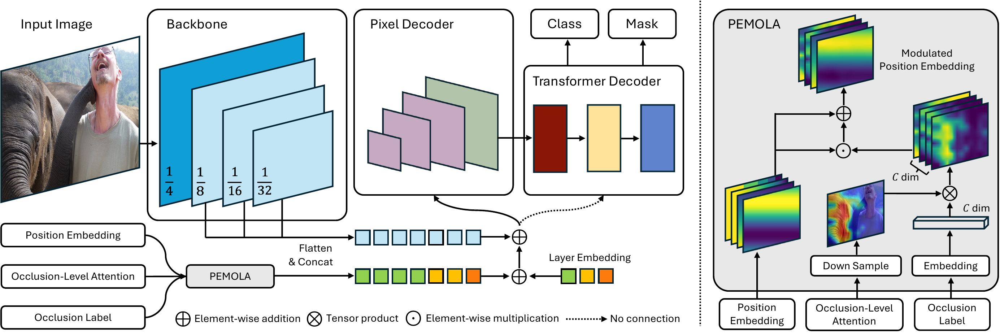

<h1 align="center">Occlusion-Aware Panoptic Segmentation with Joint Position Embedding and Occlusion-Level Attention (ICME 2026)</h1>

<p align="center">
  <a href="https://scholar.google.com/citations?user=45fCx08AAAAJ&hl=en">Wenbo Wei</a>,
  <a href="https://scholar.google.com/citations?user=b_jEBHEAAAAJ&hl=en">Jun Wang</a>,
  <a href="https://scholar.google.com/citations?user=yPKOcgQAAAAJ&hl=en">Shan Raza</a>,
  <a href="https://scholar.google.com/citations?user=XfBoSP4AAAAJ&hl=en">Abhir Bhalerao</a>
</p>

<p align="center">
  <a href="https://arxiv.org/abs/2607.18112"></a>
  <a href="https://huggingface.co/weiwb/PEMOLA"></a>
  <a href="https://pytorch.org/"></a>
  <a href="#acknowledgements"></a>
  <a href="LICENSE"></a>
</p>

<p align="center"></p>

## Table of Contents

- [News](#news)
- [Introduction](#introduction)
- [Highlights](#highlights)
- [Model Zoo &amp; Results](#model-zoo--results)
- [Installation](#installation)
- [Data Preparation](#data-preparation)
- [Training](#training)
- [Citation](#citation)
- [Acknowledgements](#acknowledgements)
- [License](#license)

## News

- [2026-09] Cityscapes-OLAC occlusion annotations are released on [GitHub Releases](https://github.com/wenbo-wei/PEMOLA/releases/tag/cityscapes-olac-annotations-v1.0).
- [2026-09] Model weights are released on [Hugging Face](https://huggingface.co/weiwb/PEMOLA).
- [2026-03] Paper accepted to **ICME 2026**.

## Introduction

<p align="justify">
Panoptic segmentation in complex scenes remains challenging because of occlusions, yet modern approaches often neglect occlusion modelling. In this paper, we propose Position Embedding Modulation with Occlusion-Level Attention (PEMOLA), a novel occlusion-aware module that can be seamlessly integrated into transformer-based panoptic segmentation. To obtain occlusion cues, we train an occlusion classifier on the COCO-OLAC dataset. The classifier derives the occlusion-level attention, which serves as spatial guidance, while the occlusion labels are encoded into a learnable embedding to produce channel-wise weights. Through joint modulation, PEMOLA elegantly introduces the occlusion priors into the position embedding, thereby improving the occlusion modelling. We further annotate the Cityscapes dataset with occlusion levels, termed Cityscapes Occlusion Labels for All Computer Vision Tasks (Cityscapes-OLAC), following the same labelling protocol as COCO-OLAC, to evaluate the cross-dataset generalisation ability of PEMOLA. Extensive experiments on COCO-OLAC and Cityscapes-OLAC demonstrate that PEMOLA consistently improves panoptic segmentation quality while introducing minimal computational overhead. These results highlight the importance of occlusion modelling, where incorporating occlusion-level attention helps deliver robust panoptic segmentation under occlusion.
</p>

## Highlights

- **Plug-and-play.** Drops into any transformer-based panoptic segmenter (Mask2Former, Mask DINO) without architectural changes to the backbone or mask decoder.
- **Occlusion-aware queries.** Combines spatial (Grad-CAM) and channel-wise (label embedding) occlusion cues directly at the joint position embedding.
- **Lightweight.** <1% added FLOPs.
- **Generalises across datasets.** Improves PQ on both **COCO-OLAC** and the newly annotated **Cityscapes-OLAC**.

## Model Zoo &amp; Results

All experiments reported in this paper are conducted on 3× NVIDIA A100 (40 GB).

`†` denotes our re-trained baseline under identical training schedule for a fair comparison.

### Panoptic Segmentation on COCO-OLAC

| Method | Backbone | $\text{PQ}$ | $\text{PQ}^{\text{Th}}$ | $\text{PQ}^{\text{St}}$ | $\text{AP}_{\text{pan}}^{\text{Th}}$ | $\text{mIoU}_{\text{pan}}$ | Config | Weights |
| :--- | :--- | :---: | :---: | :---: | :---: | :---: | :---: | :---: |
| Mask2Former † | ResNet-50 | 40.7 | 44.5 | 35.0 | 30.0 | 54.2 | [config](configs/coco_olac/panoptic-segmentation/mask2former_COCO-OLAC_R50_bs16_50ep.yaml) | [download](https://huggingface.co/weiwb/PEMOLA/resolve/main/mask2former_coco_olac.pth) |
| **+ PEMOLA** | ResNet-50 | **41.5** | **45.2** | **35.9** | **30.4** | **54.8** | [config](configs/coco_olac/panoptic-segmentation/pemola_R50_bs16_50ep.yaml) | [download](https://huggingface.co/weiwb/PEMOLA/resolve/main/mask2former_pemola_coco_olac.pth) |
| Mask DINO † | ResNet-50 | 44.0 | 48.5 | 37.3 | 33.5 | 53.4 | [config](https://github.com/wenbo-wei/MaskDINO/blob/main/configs/coco_olac/panoptic-segmentation/maskdino_R50_bs16_50ep_3s_dowsample1_2048.yaml "Use MODEL.OAM.PE_MODULATION False for the baseline") | [download](https://huggingface.co/weiwb/PEMOLA/resolve/main/maskdino_coco_olac.pth) |
| **+ PEMOLA** | ResNet-50 | **44.8** | **49.4** | **37.8** | **34.2** | **55.3** | [config](https://github.com/wenbo-wei/MaskDINO/blob/main/configs/coco_olac/panoptic-segmentation/maskdino_R50_bs16_50ep_3s_dowsample1_2048.yaml) | [download](https://huggingface.co/weiwb/PEMOLA/resolve/main/maskdino_pemola_coco_olac.pth) |

### Panoptic Segmentation on Cityscapes-OLAC

| Method | Backbone | $\text{PQ}$ | $\text{PQ}^{\text{Th}}$ | $\text{PQ}^{\text{St}}$ | $\text{AP}_{\text{pan}}^{\text{Th}}$ | $\text{mIoU}_{\text{pan}}$ | Config | Weights |
| :--- | :--- | :---: | :---: | :---: | :---: | :---: | :---: | :---: |
| Mask2Former † | ResNet-50 | 61.5 | 54.0 | 66.9 | 35.2 | 76.1 | [config](configs/cityscapes/panoptic-segmentation/maskformer2_R50_bs16_90k.yaml) | [download](https://huggingface.co/weiwb/PEMOLA/resolve/main/mask2former_cityscapes_olac.pth) |
| **+ PEMOLA** | ResNet-50 | **62.3** | **55.4** | **67.2** | **38.5** | **77.4** | [config](configs/cityscapes/panoptic-segmentation/maskformer2_R50_bs16_90k.yaml "Use MODEL.PEMOLA.PE_MODULATION True for PEMOLA") | [download](https://huggingface.co/weiwb/PEMOLA/resolve/main/mask2former_pemola_cityscapes_olac.pth) |

### Occlusion Classifier

<table>
<thead>
<tr>
  <th align="left">Method</th>
  <th align="center">Pretraining</th>
  <th align="center">Input</th>
  <th align="center">Top-1 Acc (%)</th>
  <th align="center">Config</th>
  <th align="center">Weights</th>
</tr>
</thead>
<tbody>
<tr><td align="left">ResNet-50</td>       <td align="center">ImageNet-1K</td>       <td align="center">224</td> <td align="center">70.3</td>     <td align="center"><a href="configs/occlusion_cls/resnet/resnet50.yaml">config</a></td><td align="center">—</td></tr>
<tr><td align="left">ResNet-101</td>      <td align="center">ImageNet-1K</td>       <td align="center">224</td> <td align="center">70.8</td>     <td align="center"><a href="configs/occlusion_cls/resnet/resnet101.yaml">config</a></td><td align="center">—</td></tr>
<tr><td align="left">Swin-T</td>          <td align="center">ImageNet-22K</td>      <td align="center">224</td> <td align="center">71.6</td>     <td align="center"><a href="configs/occlusion_cls/swin/swin_tiny_patch4_window7_224_22k.yaml">config</a></td><td align="center">—</td></tr>
<tr><td align="left">Swin-S</td>          <td align="center">ImageNet-22K</td>      <td align="center">224</td> <td align="center">71.4</td>     <td align="center"><a href="configs/occlusion_cls/swin/swin_small_patch4_window7_224_22k.yaml">config</a></td><td align="center">—</td></tr>
<tr><td align="left">Swin-B</td>          <td align="center">ImageNet-22K</td>      <td align="center">224</td> <td align="center">71.7</td>     <td align="center"><a href="configs/occlusion_cls/swin/swin_base_patch4_window7_224_22k.yaml">config</a></td><td align="center">—</td></tr>
<tr><td align="left">Swin-B</td>          <td align="center">ImageNet-22K</td> <td align="center">384</td> <td align="center">75.3</td>     <td align="center"><a href="configs/occlusion_cls/swin/swin_base_patch4_window12_384_22kto1k_finetune.yaml">config</a></td><td align="center">—</td></tr>
<tr><td align="left">Swin-L</td>          <td align="center">ImageNet-22K</td>      <td align="center">224</td> <td align="center">73.0</td>     <td align="center"><a href="configs/occlusion_cls/swin/swin_large_patch4_window7_224_22k.yaml">config</a></td><td align="center">—</td></tr>
<tr><td align="left"><b>Swin-L</b></td>    <td align="center">ImageNet-22K</td> <td align="center">384</td> <td align="center"><b>75.3</b></td> <td align="center"><a href="configs/occlusion_cls/swin/swin_large_patch4_window12_384_22kto1k_finetune.yaml">config</a></td><td align="center"><a href="https://huggingface.co/weiwb/PEMOLA/resolve/main/occl_classifier_swin_large_window12_384_coco_olac.pth">download</a></td></tr>
</tbody>
</table>

From the PEMOLA repository root, download all model weights at once using the following commands:

```bash
python -m pip install huggingface_hub

hf download weiwb/PEMOLA --local-dir checkpoints
```

## Installation

A single command sets up the `pemola` conda environment:

```bash
bash install_env.sh
```

**Note:** Before running the installer, set `ARCH` to your GPU architecture (default: `8.9` for RTX 4090).

## Data Preparation

PEMOLA is evaluated on **COCO-OLAC** ([Wei *et al.*, 2025](https://github.com/wenbo-wei/COCO-OLAC)) and **Cityscapes-OLAC** (introduced in this work). Follow Mask2Former's dataset preparation [instructions](https://github.com/facebookresearch/Mask2Former/blob/main/datasets/README.md) to generate the required semantic and panoptic annotations in advance. Set `DETECTRON2_DATASETS=datasets/data` so that Detectron2 resolves dataset paths correctly. The datasets should be placed under `datasets/data` following the structure below:

```
datasets/data/
  coco_olac/
    annotations/
      instances_{train,val,val_low,val_mid,val_high}.json
      panoptic_{train,val,val_low,val_mid,val_high}.json
    {train,val,val_low,val_mid,val_high}/  # RGB images
    {train,val}_blackbg/                  # background-blackened images
    panoptic_{train,val,val_low,val_mid,val_high}/
    panoptic_semseg_{train,val,val_low,val_mid,val_high}/
    panoptic_stuff_{train,val,val_low,val_mid,val_high}/
    occlusion_label_{train,val,val_low,val_mid,val_high}.json
  coco_olac_cam/
    cam_pt_{train,val}/                   # CAM tensors
  cityscapes_olac/
    leftImg8bit/
      {train,val}/                       # RGB images
      {train,val}_{low,mid,high}/
      {train,val}_blackbg/
    gtFine/
      {train,val}/                       # annotations
      {train,val}_{low,mid,high}/
      cityscapes_panoptic_{train,val}/
      cityscapes_panoptic_{train,val}.json
      cityscapes_panoptic_{train,val}_{low,mid,high}/
      cityscapes_panoptic_{train,val}_{low,mid,high}.json
      occlusion_label_{train,val}.json
  cityscapes_cam/
    cam_pt_{train,val}/                   # CAM tensors
  coco_olac_cls/
    {train,val,test}/                     # classifier images
    {train,val,test}_blackbg/
    occlusion_label_{train,val,test}.json
```

### Cityscapes-OLAC annotations

Download the occlusion-level annotations from [GitHub Releases](https://github.com/wenbo-wei/PEMOLA/releases/tag/cityscapes-olac-annotations-v1.0):

| File | Images | Size | Download |
|:-----|:------:|:----:|:--------:|
| `occlusion_label_train.json` | 2,975 | 96.9 KiB | [Download](https://github.com/wenbo-wei/PEMOLA/releases/download/cityscapes-olac-annotations-v1.0/occlusion_label_train.json) |
| `occlusion_label_val.json` | 500 | 16.5 KiB | [Download](https://github.com/wenbo-wei/PEMOLA/releases/download/cityscapes-olac-annotations-v1.0/occlusion_label_val.json) |

Each JSON maps a Cityscapes image ID (e.g., `weimar_000095_000019`, without the `_leftImg8bit.png` suffix) to `low`, `mid`, or `high`, following the same annotation protocol as [COCO-OLAC](https://github.com/wenbo-wei/COCO-OLAC#annotation-format).

Save both JSON files in `datasets/cityscapes_olac/` (the same annotations are also included in this repository). Download the original images and `gtFine` annotations from [Cityscapes](https://www.cityscapes-dataset.com/downloads/) into `datasets/data/cityscapes/`. From the PEMOLA repository root, generate the semantic training IDs and panoptic annotations, then build Cityscapes-OLAC:

```bash
export CITYSCAPES_DATASET="$PWD/datasets/data/cityscapes"
python -m cityscapesscripts.preparation.createTrainIdLabelImgs
python -m cityscapesscripts.preparation.createPanopticImgs --set-names train val

python tools/prepare_cityscapes_olac.py \
    --cityscapes_root datasets/data/cityscapes \
    --labels_dir datasets/cityscapes_olac \
    --output datasets/data/cityscapes_olac

export DETECTRON2_DATASETS=datasets/data
```

This creates the complete train/val splits and their low/mid/high subsets, and places the occlusion labels under `datasets/data/cityscapes_olac/gtFine/`. Files are symlinked by default, so keep the source Cityscapes directory; add `--copy` to create independent copies. Original Cityscapes images and segmentation annotations are not included in the Release.

### Background-blackened images

The **occlusion classifier** uses the separate `coco_olac_cls` splits. Use the following command to blacken image backgrounds:

```bash
python tools/blacken_bg.py \
    --data_path  datasets/data/coco_olac/train \
    --ann_path   datasets/data/coco_olac/annotations/instances_train.json \
    --output     datasets/data/coco_olac/train_blackbg
```

## Training

### 1. Occlusion classifier

```bash
bash scripts/occ_cls_train_swin.sh    # Swin-L,  used in main results
bash scripts/occ_cls_train_res.sh     # ResNet baselines (50 / 101)
```

### 2. PEMOLA panoptic segmentation on COCO-OLAC

```bash
bash scripts/train_pemola_olac_r50.sh      # ResNet-50
```

### 3. PEMOLA panoptic segmentation on Cityscapes-OLAC

```bash
bash scripts/train_pemola_city_r50.sh      # ResNet-50
```

## Citation

If you find PEMOLA useful for your research, please consider citing:

```bibtex
@inproceedings{wei2026pemola,
  title     = {Occlusion-Aware Panoptic Segmentation with Joint Position Embedding and Occlusion-Level Attention},
  author    = {Wei, Wenbo and Wang, Jun and Raza, Shan and Bhalerao, Abhir},
  booktitle = {IEEE International Conference on Multimedia and Expo (ICME)},
  year      = {2026}
}
```

For the **COCO-OLAC** benchmark used in our experiments, please also cite:

```bibtex
@article{wei2025cocoolac,
  title   = {COCO-OLAC: An Occlusion-Level Annotated COCO Benchmark for Panoptic Segmentation},
  author  = {Wei, Wenbo and others},
  journal = {arXiv preprint},
  year    = {2025}
}
```

## Acknowledgements

PEMOLA is built on top of the following open-source projects.
Modified portions retain the original copyright headers, in accordance with each project's licence.

- [**Mask2Former**](https://github.com/facebookresearch/Mask2Former) (Meta, MIT) — base panoptic framework.
- [**Mask DINO**](https://github.com/IDEA-Research/MaskDINO) (IDEA, Apache 2.0) — alternative panoptic baseline used in our Mask DINO experiments.
- [**Swin Transformer**](https://github.com/microsoft/Swin-Transformer) (Microsoft, MIT) — Swin-L backbone and occlusion classifier.
- [**Deformable DETR**](https://github.com/fundamentalvision/Deformable-DETR) (SenseTime, Apache 2.0) — MSDeformAttn CUDA op.
- [**pytorch-grad-cam**](https://github.com/jacobgil/pytorch-grad-cam) (Jacob Gildenblat, MIT) — used as an external dependency for extracting occlusion-level attention via Grad-CAM in `occ_cls_draw_cam.py`. No source code is copied. The library is imported through `pip install grad-cam`.

We thank the authors of these works for releasing their code.

## License

This project is released under <a href="LICENSE"></a>.
Code adapted from third-party projects retains its original licence and copyright notice.
